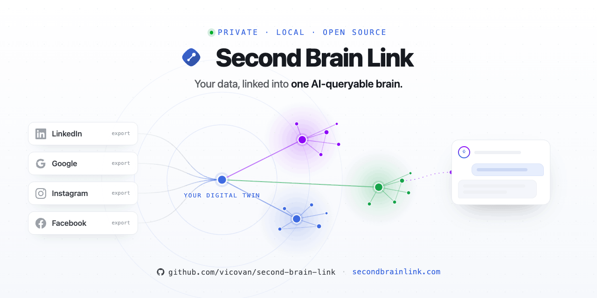
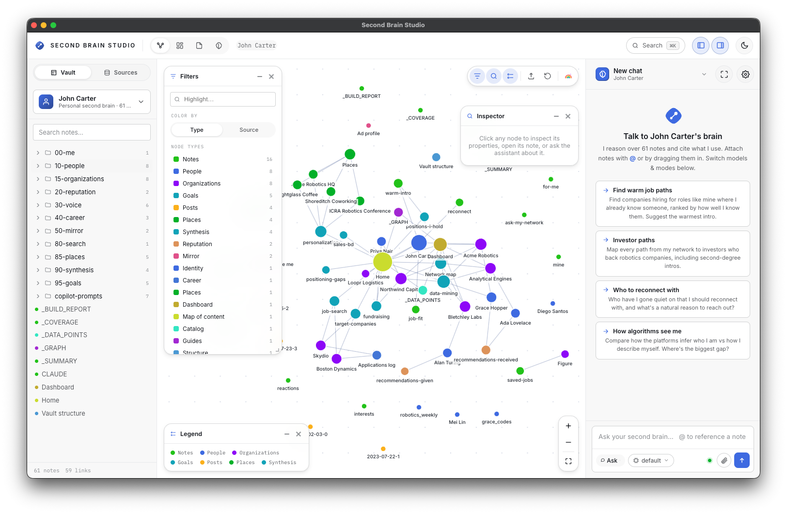
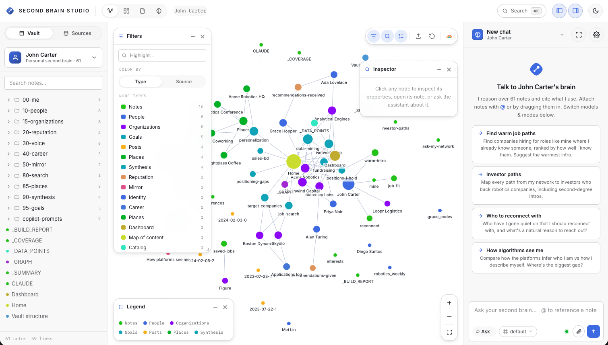
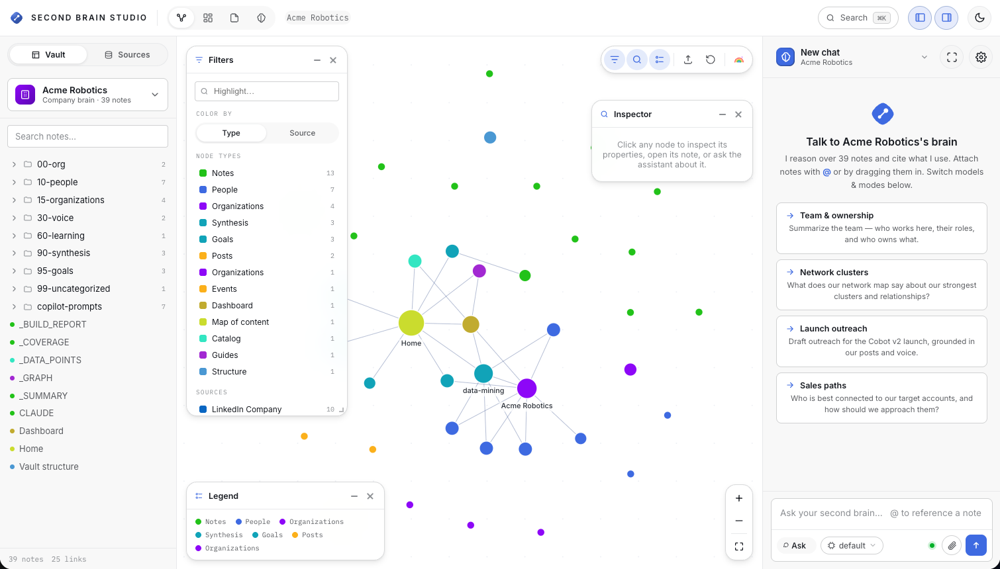
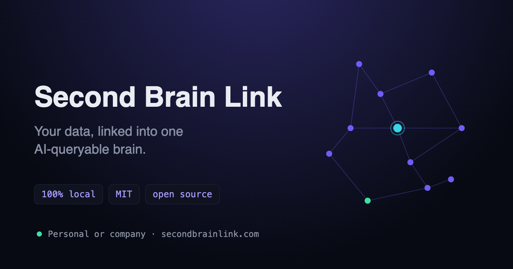

<h1>&nbsp;Second Brain Link</h1>



[](LICENSE)
[](https://github.com/vicovan/second-brain-link/actions/workflows/tests.yml)
[](#privacy-details)
[](https://www.python.org/)
[](CONTRIBUTING.md)
[](https://secondbrainlink.com)
[](https://secondbrainlink.com/studio)
[](https://github.com/vicovan/second-brain-studio-releases/releases/latest)

**Bootstrap a brain — personal or company — from the data you already have. Turn your exports (LinkedIn, Facebook, Instagram, Google) — or your org's (LinkedIn Company, Google Workspace, Slack) — into a private, local, AI-queryable digital twin, on your machine, working *for* you.**

`secondbrainlink.com` · Local-first · MIT licensed · A **cross-model Agent Skill** for [Claude Code](https://claude.com/claude-code) **and** [OpenAI Codex](https://openai.com) (Agent Skills standard) · opens in [Obsidian](https://obsidian.md) · also exports to [GBrain](https://github.com/garrytan/gbrain)

> **Works with both Claude and OpenAI.** One shared engine (`engine/`), two thin
> provider packagings (`providers/claude`, `providers/openai`) built by
> `packaging/build_skill.py`. Personal + company exports in one run produce two
> sibling vaults — `personal-brain/` and `company-brain/`. Output target is
> pluggable: Obsidian (default) or a GBrain repo (`--emit gbrain|both`).

> Your life is scattered across platforms — connections on LinkedIn, friends on Facebook, follows on Instagram, contacts and calendar in Google. Each gives you a data export, and each sits dead in a zip. Second Brain Link pulls them into **one** structured knowledge vault your AI can think with — and the same person across two networks becomes a single, richer note. Give it a goal — **Get Me Hired**, **Get My Startup Funded** — and it works your whole network to get you there.

**Multi-source by design.** **25 sources ship today** — 13 personal (LinkedIn, Facebook, Instagram, Google Takeout, Amazon, X/Twitter, WhatsApp, GitHub, YouTube, Strava, Reddit, Spotify, TikTok) and 12 company (LinkedIn Company, Google Workspace, Slack, Notion, Confluence, Jira, Salesforce, HubSpot, Zendesk, Email/mbox, Microsoft 365, Teams) — with export + import steps for each in **[docs/SOURCES.md](docs/SOURCES.md)**. The architecture adds any future network with a data export through a drop-in adapter file or a declarative JSON mapping. One vault, every source — and every note tagged by source so the **graph** shows all of it connected.

---

## 🎨 Second Brain Studio — see & talk to your brain (web + desktop)

**Studio is the visual front door to a built brain.** Explore the cross-source **graph**, browse the **dashboard** and individual **notes**, and **talk to your brain** in plain English (*"who are my warmest intros to a Series A investor?"*). It runs right in your **browser**, or as a native **desktop app** (Mac · Windows · Linux) that drives **Claude Code / Codex locally** over your vault — your data never leaves your machine.



<table>
  <tr>
    <td width="50%"></td>
    <td width="50%"></td>
  </tr>
  <tr>
    <td align="center"><sub><b>Web Studio</b> · a personal brain (digital twin)</sub></td>
    <td align="center"><sub><b>Web Studio</b> · a company brain</sub></td>
  </tr>
</table>

### Get Studio

- **▶ Try it in your browser — no install** → **[secondbrainlink.com/studio](https://secondbrainlink.com/studio)**
- **⬇ Download the desktop app** — all downloads + release notes on the **[latest release](https://github.com/vicovan/second-brain-studio-releases/releases/latest)**:

  | Platform | Download |
  |---|---|
  | **macOS** (Apple Silicon) | [`SecondBrainStudio-mac-arm64.dmg`](https://github.com/vicovan/second-brain-studio-releases/releases/latest/download/SecondBrainStudio-mac-arm64.dmg) |
  | **macOS** (Intel) | [`SecondBrainStudio-mac-x64.dmg`](https://github.com/vicovan/second-brain-studio-releases/releases/latest/download/SecondBrainStudio-mac-x64.dmg) |
  | **Windows** 10/11 (x64) | [`SecondBrainStudio-windows-x64.exe`](https://github.com/vicovan/second-brain-studio-releases/releases/latest/download/SecondBrainStudio-windows-x64.exe) |
  | **Linux** (AppImage) | [`SecondBrainStudio-linux-x64.AppImage`](https://github.com/vicovan/second-brain-studio-releases/releases/latest/download/SecondBrainStudio-linux-x64.AppImage) |

  > Builds are **unsigned**. **macOS:** right-click the app ▸ *Open* (or `xattr -dr com.apple.quarantine "/Applications/Second Brain Studio.app"`). **Windows:** SmartScreen ▸ *More info* ▸ *Run anyway*.

- **⬇ Prefer a one-file Agent Skill install?** Drop the prebuilt `.skill` straight into your agent (no clone, no build):
  - **[Claude Code skill](https://github.com/vicovan/second-brain-link/raw/main/dist/claude/second-brain-link.skill)** — `dist/claude/second-brain-link.skill`
  - **[OpenAI Codex skill](https://github.com/vicovan/second-brain-link/raw/main/dist/openai/second-brain-link.skill)** — `dist/openai/second-brain-link.skill`

> **How it fits together:** Second Brain Link (this repo) **builds** the vault from your exports; **Studio** is how you **see and use** it. Build with the skill below (or the CLI), then open the vault in Studio — or in [Obsidian](https://obsidian.md), or any AI agent.

---

## ⚡ Quick start (begin here)

**1 · Download your data** (each platform gives it to you; pick **JSON** where asked):
- **LinkedIn** → Settings & Privacy → Data Privacy → *Get a copy of your data* → "the larger archive".
- **Facebook** → Settings → *Your information* → *Download your information* → **format: JSON**.
- **Instagram** → Accounts Center → *Your information and permissions* → *Download your information* → **JSON**.
- **Google** → [takeout.google.com](https://takeout.google.com) → select **Contacts, Calendar, YouTube, Maps, Profile**.

**2 · Put the exports where the tool looks.** The repo ships two rename-me template folders — `data/personal/your-name/` and `data/company/your-company/` — each with the source subfolders ready. **Rename `your-name` to your actual name** (e.g. `data/personal/jane/`), then unzip each export into the matching source subfolder:
```
data/personal/jane/linkedin/…
data/personal/jane/facebook/…      ← the unzipped "facebook-<name>-…" folder
data/personal/jane/instagram/…
data/personal/jane/google/…        ← your Takeout/ folder
```
(One source is fine too. A company brain goes under `data/company/<org>/<source>/…` — rename `your-company` the same way.) The **folder name becomes your brain** (`vault/personal/jane-brain/`); multiple people/orgs each get their own. If you forget to rename and just drop files into `your-name/`, the builder still works — it names the brain after the identity it detects and prints a tip to rename the folder.

**3 · Get the skill into your agent.** Clone, then build + install the Agent Skill for Claude Code and/or OpenAI Codex:
```bash
git clone https://github.com/vicovan/second-brain-link && cd second-brain-link
python3 packaging/build_skill.py all --install
#   Claude Code → ~/.claude/skills/   ·   OpenAI Codex → ~/.agents/skills/
```
Now open **Claude Code** (or Codex) in this folder — the `second-brain-link` skill auto-loads. (Prefer not to install? The engine is plain Python: run the `python3 engine/scripts/…` commands below directly.)

**4 · Tell the agent what to do.** Plain-English prompts — the skill runs the right scripts:
- **Build the brain:** *"Build my second brain from the exports in `data/` — profile them first, show me the mindmap and planned structure, then build the vault with `--full`."*
- **Adapt / generate mappings (only if something's unrecognized):** *"`_COVERAGE.md` lists files under 'Needs a mapping' — write a mapping rule to capture them precisely and rebuild."*
- **Activate for your goals:** *"Set up my brain for fundraising, sales/BD, job-search, data-mining and personalization — generate the goal workspaces, the dashboard, the data-points catalog, and color my Obsidian graph by source."*
  → runs `analyze.py … --goals fundraising,bd,jobsearch,datamining,personalization --graph-config <vault>/.obsidian/graph.json`.

Or run it yourself:
```bash
S=engine/scripts
python3 $S/build_vault.py data -o vault --full              # build one brain per entity
python3 $S/analyze.py vault/personal/<you>-brain \
        --goals fundraising,bd,jobsearch,datamining,personalization \
        --graph-config vault/.obsidian/graph.json            # goals + catalog + graph colors
```

**5 · Use the brain.** Open the `vault/` folder in **[Obsidian](https://obsidian.md)**:
- Start at **`Home.md`**; **`_STRUCTURE.md`** maps every folder/file; **`_DATA_POINTS.md`** catalogs every data point + relation; **`Dashboard.md`** has live tables.
- Open the **Graph view** — every note is colored by source (LinkedIn/Facebook/Instagram/Google) and type, so you see your whole life connected. **`_GRAPH.md`** is the legend + filters.
- Install the **Obsidian Copilot** plugin and point its custom-prompts folder at `copilot-prompts/` for one-click `/commands` (`/warm-intro`, `/investor-paths`, `/mine`, `/for-me`, …); use **Vault QA** for open questions.
- Keep working with **Claude Code / Codex** over the vault for deep, multi-step asks ("draft the 5 best investor intros in my voice").

That's it. Everything below is the deeper how-and-why.

---

## What it does

1. You download your own data archive(s) — from one network or several. They're yours; each platform gives them to you on request.
2. Second Brain Link runs **100% locally**, detects which source(s) you've given it, and transforms them into one clean Obsidian vault: people, companies, your voice, your career intent, your interests, and how the algorithms categorize you.
3. You point Claude at the vault. Now you have a digital twin that knows your whole history across platforms and can reason, plan, and draft from it.

Nothing is uploaded. No account, no server, no telemetry. The output is plain Markdown files you fully own.

### Supported sources

**25 sources.** Full per-source detail — what each pulls in, exact export/download
steps at every vendor, and import instructions — lives in **[docs/SOURCES.md](docs/SOURCES.md)**.

**Personal** (build a *digital twin*): LinkedIn *(most complete)* · Facebook *(full
mapping incl. the algorithmic mirror + check-ins→map)* · Instagram · Google Takeout
*(contacts, calendar, Maps places + Location-History visits + photo spots → map,
My-Activity searches, YouTube taste)* · Amazon *(orders/subscriptions → shopping,
reviews → voice, searches, Prime Video/Kindle taste, ad-audiences → mirror)* ·
X/Twitter *(tweets + note-tweets → voice)* ·
WhatsApp *(contact signal only — chat text never read)* · GitHub *(code voice)* ·
YouTube · Strava *(training spots → map)* · Reddit · Spotify *(taste + inferences)* ·
TikTok.

**Company** (build a *Company Brain*): LinkedIn Company *(employees + departments)* ·
Google Workspace *(org units, calendars + attendees, groups)* · Slack *(channels +
membership; text never read)* · Notion *(wiki → institutional voice)* · Confluence
*(pages + authors)* · Jira *(ownership + components)* · Salesforce *(accounts,
deals, case signal)* · HubSpot · Zendesk · Email/mbox *(headers only)* ·
Microsoft 365 · Teams *(signal only)*.

Give it **one** source or a **combined** archive with several — it detects and merges
them all. **Personal + company sources in one export build two sibling vaults**
(`personal-brain/` rooted on you, `company-brain/` rooted on the org). Unknown files
are summarized, never dropped; excluded-by-design files are reported honestly as
`skipped` in `_COVERAGE.md`. New sources = one adapter file in
`engine/scripts/sources/{personal,company}/` or a declarative JSON mapping in
`engine/mappings/sources/` (auto-discovered).

### The multi-source superpower: one person, merged

If "Sam Patel" is a LinkedIn connection, a Facebook friend, *and* a Google contact, you don't get three notes — you get **one**, tagged `sources: [linkedin, facebook, google]`, with company/role filled in from whichever source knew it. Your graph becomes a single unified map of everyone you know, everywhere. People who appear across multiple networks are surfaced as your strongest multi-context relationships.

---

## What people actually use it for

The real magic isn't search — it's giving your AI a **goal** and letting it work your own network and history to reach it.

### 🎯 Get Me Hired
> *"Find companies hiring for roles like mine where I already have a connection, rank them by how strong that connection is, and draft a warm intro request to each in my voice."*

Cross-references your network, your application history, and how you've described roles before — so you stop cold-applying and start getting referred.

### 💰 Get My Startup Funded
> *"Map every path from my network to investors who back companies like mine, including second-degree intros through people I'm close to, and draft the ask."*

Your connection graph is a fundraising map most founders never read.

### 🤝 Get Me Clients / Win New Business
> *"Who in my network fits my ideal customer profile, who have I gone quiet on, and what's a non-salesy reason to reconnect with each?"*

### 🪞 Show Me How the Algorithms See Me
> *"What do these platforms' algorithms think I am, and how does that differ from how I describe myself?"*

Your exports contain the platforms' *own* machine-read of you (LinkedIn's `Inferences_about_you` and ad targeting, plus the topics/interests Instagram and Facebook infer). This is the share-bait everyone screenshots — and it's genuinely useful for fixing your positioning.

### ✍️ Write in My Voice
> *"Draft a LinkedIn post on [topic] consistent with the positions I've actually taken publicly."*

Because it learns your real stances from what you've posted and commented — not a generic AI voice.

### ☎️ Prep Me for This Meeting
> *"I'm meeting [name] tomorrow — who are they, how do I know them, when did we last talk, and what's our history?"*

### 🔌 Reactivate My Dormant Network
> *"Show me my strongest connections I haven't spoken to in over a year, and why each is worth reconnecting with now."*

### 🧭 Find My Network's Blind Spots
> *"Break my network down by industry and seniority — where am I strong, and where am I thin relative to where I want to go next?"*

> **One honest limit:** the export is a snapshot, so the twin is brilliant on your *history* and blind to *this week's* news (who just changed jobs, what's hiring right now). Re-export periodically to refresh it.

---

## Why it's different

- **Local-first and private by construction.** The transform makes zero network calls. Your data never leaves your machine.
- **Privacy isn't a promise, it's in the code.** Across every source, your contacts' emails and phone numbers are stripped at parse time and never written. Message *bodies* are never imported — only a derived "how often / how recently" signal. Sensitive files (logins, receipts, contact dumps) are never touched.
- **You own the output.** Plain Markdown. No lock-in. Delete it, fork it, grep it.
- **It's yours and it's free.** MIT licensed, no catch.

---

## How it works — multi-source, self-adapting, self-improving

Every network changes its export format over time and across regions, and uses a different shape entirely (LinkedIn ships CSVs, Facebook and Instagram ship JSON, Google Takeout is a mixed archive). A hardcoded converter breaks the moment any of that drifts. Second Brain Link doesn't convert blindly — it **detects which source(s) you have, inspects your specific export, adapts to it, builds one unified vault, then verifies it left nothing behind.**

```
  ┌─────────┐     ┌──────────┐     ┌────────┐     ┌─────────┐
  │ DETECT  │ ──▶ │  ADAPT   │ ──▶ │ BUILD  │ ──▶ │ VERIFY  │
  │ +PROFILE│     │          │     │        │     │         │
  └─────────┘     └──────────┘     └────────┘     └─────────┘
   which source    optimize the     normalize ALL  coverage
   (s)? read every  mapping to YOUR  sources into   report; loop
   file & column    actual schema    ONE vault      if gaps remain
   → schema map                      (seconds)
```

1. **Detect + profile.** It identifies the source(s) in your archive — even a combined one — then reads every file and column and writes a `schema_map.md`: each file classified, each column with type, fill-rate, and a privacy-safe sample, plus a flagged list of anything unexpected. It also draws a **mindmap** (every file & column) and designs a **brain-structure** for the vault — all PII-safe (names only, never values).
2. **Adapt.** Each source is described by a **declarative JSON mapping** (`engine/mappings/sources/<name>.json`) that the engine interprets — selectors handle nested/renamed shapes so `"Organization"` still becomes *company*. Files no mapping claims are rescued by a **universal harvester** (it recognizes people/places/posts/interests/message-signal in any shape, so nothing is lost) and flagged in `_COVERAGE.md` under **"Needs a mapping"** — the cue to add a rule for precision. Only genuine unknowns need your AI: it reads the small schema map (never your raw data) and proposes a mapping/overrides file.
3. **Build.** A deterministic, dependency-free Python engine writes the entire unified vault in seconds with zero AI cost, **merging people who appear in more than one source into a single note**, and pre-computes the analytical "synthesis" notes.
4. **Verify (+ correlate).** A `_COVERAGE.md` reports the detected sources and how much of your export was leveraged, and a `_SUMMARY.md` gives the seed counts at a glance (notes per layer + people/orgs/places totals). Anything unrecognized is summarized into `99-uncategorized/` rather than lost — so **nothing is ever silently dropped**. With **multiple identities/companies**, a final pass builds a `_correlations/` brain linking the same person across brains, shared organizations, and identity↔company `works_at` edges.

**Generic by architecture.** One provider-neutral **engine** (`engine/`) does the work; thin per-provider manifests (`providers/claude`, `providers/openai`) ship it as a cross-model Agent Skill. **Adding a new network (X, GitHub, Strava, anything with a data export) is usually just a JSON mapping** — no Python, no engine edit (drop in a Python adapter under `engine/scripts/sources/personal|company/` only for genuinely bespoke logic; it's auto-discovered). The builder, privacy rules, output emitters (Obsidian default, GBrain opt-in), and cross-source merging all work unchanged. The structure of *your* brain is shaped by *your* data: a heavy poster gets a rich voice layer, a quiet lurker doesn't. The vault is a superset; you get the subset your sources support.

---

## The vault it builds

```
your-vault/
├── Home.md                      # 🏠 START HERE — map of content + example prompts
├── CLAUDE.md                    # tells Claude how to navigate efficiently + privacy rules
├── 00-me/                       # IDENTITY — who the twin speaks as
│   ├── identity.md              #   profile, summary, skills, top endorsements
│   ├── positions/               #   one note per role
│   ├── education.md · skills.md · certifications.md · languages.md
├── 10-people/                   # NETWORK — one note per person (emails/phones stripped)
├── 15-organizations/            # companies: employers, targets, vendors, followed
├── 20-reputation/               # recommendations + endorsements (your social proof)
├── 30-voice/                    # posts, comments, reactions, interests, saved items
├── 40-career/                   # applications, preferences, saved jobs, reusable answers
├── 50-mirror/                   # HOW THE ALGORITHMS SEE YOU — inferences + ad profile
├── 60-learning/                 # courses, coaching, events (incl. Google Calendar)
├── 70-services/                 # freelance / Services Marketplace (if used)
├── 80-search/                   # your search history — a curiosity log
├── 85-places/                   # saved/reviewed locations (Google Maps, IG places)
├── 90-synthesis/                # THE PAYOFF (derived, not raw):
│   ├── network-map.md           #   clusters, people-by-source, strongest & dormant ties
│   ├── positions-i-hold.md      #   your real public stances (for writing in your voice)
│   ├── target-companies.md      #   where you've actually been aiming
│   └── positioning-gaps.md      #   how you describe yourself vs how the algorithms tag you
├── 99-uncategorized/            # any file the tool didn't recognize, summarized (never dropped)
├── _quarantine/                 # sensitive files — intentionally NOT imported
├── _notes/                      # YOURS — the engine never writes, updates or deletes here
├── _STRUCTURE.md                # 🗺️ THE MAP — every folder/file above + its role (always generated)
├── _SUMMARY.md                  # seed counts: notes per layer + coverage (+ _COVERAGE.md, _BUILD_REPORT.md)
│   # ── added by `analyze.py` (the goals/value step) ──
├── Dashboard.md                 # live Dataview tables (warm/dormant ties, clusters, by-source)
├── _DATA_POINTS.md              # 🧭 catalog of every data point + relation + which source enriched each field
├── _GRAPH.md                    # how to read the cross-source graph (colored by source + type) + legend
├── 95-goals/                    # goal workspaces (incl. data-mining.md, personalization.md)
└── copilot-prompts/             # Obsidian-Copilot /commands (/warm-intro, /mine, /for-me, …)
```

**`_STRUCTURE.md` is your map** — open it first; it documents what every folder and file is and what feeds it, so you (or an agent) always know where things live.

Every note carries a `sources` property (e.g. `sources: [linkedin, facebook]`) **and `source/<name>` + type tags** (e.g. `#source/facebook`, `#person`, `#place/check-in`) so you always know where each fact came from — and the **Graph view** colors and filters every data point by source and type. People seen in multiple networks are merged into one note listing all of them.

The `90-synthesis/` notes are the summarized "brains" of each layer — they're what your AI reads first, so it never has to wade through thousands of raw notes.

**One brain per entity.** With multiple identities/companies under `data/`, each becomes its own vault — `vault/personal/<id>-brain/` (rooted on `00-me/`) and `vault/company/<co>-brain/` (rooted on `00-org/`) — plus a `vault/_correlations/` brain that links the same person across brains, surfaces shared organizations, and draws identity↔company `works_at` edges. A company brain swaps `00-me/` for `00-org/`, adds a `data-handling.md` data-controller note, and uses **company-named layers**: `20-brand/`, `30-content/`, `40-pipeline/` (one note per deal/campaign), `50-market-view/`, `60-knowledge/` (meetings + events), `70-support/`, `80-signals/`, `85-locations/` — same layer keys, subject-appropriate names (`_STRUCTURE.md` maps them either way).

**Owner mode (`--full`).** The default build is privacy-safe (third-party emails/phones stripped, message bodies never read, sensitive files quarantined). For *your own* brain on *your own* machine, `--full` captures everything — emails, phones, every extra column, and the otherwise-quarantined personal files folded into `00-me/` as `my-*.md` tables — so no field is dropped.

**Updating with a newer archive (`--refresh`).** Exports are snapshots; when you download a fresh one, add `--refresh` instead of rebuilding over your edits. Every generated file is tracked in `_GENERATED.json` (path + hash), so the engine knows exactly what it owns: unedited engine notes update in place, **notes you edited are kept** (the fresh version lands beside them as `<name>.new.md`), stale unedited notes are removed, and everything you created — any folder, plus all of `_notes/` — is untouched. The run is summarized in `_UPDATE_REPORT.md`; re-run `analyze.py` afterwards. Studio's **Reseed** offers the same choice: **Update** (refresh) or **Rebuild from scratch**.

---

## Turn it into action — goal workspaces, dashboard & Copilot

A brain is only useful once pointed at a goal. After building, the skill **asks what you want to use it for** and runs the analyzer:

```bash
python3 engine/scripts/analyze.py vault/personal/<you>-brain \
  --goals fundraising,bd,jobsearch,datamining,personalization \
  --thesis "<what you raise for>" --icp "<who you sell to>" \
  --graph-config vault/.obsidian/graph.json
```

It's deterministic and re-runnable in seconds (reads the built brain's frontmatter — no rebuild), and writes:
- **`95-goals/<goal>.md`** — ranked tables that answer the goal, each ending in a ready-to-run AI prompt. Built-in goals: **fundraising** (investors in your network, by who connects you there) · **bd** (warm/dormant decision-makers) · **jobsearch** (companies you applied to × people you know there) · **datamining** (clusters, multi-source-confirmed people, mirror-vs-stated gaps) · **personalization** (recommend-me-X grounded in your own places/interests/mirror — solving the cold-start problem).
- **`Dashboard.md`** — tag-based [Dataview](https://github.com/blacksmithgu/obsidian-dataview) tables (warm/dormant ties, network-by-company, a **by-source** breakdown).
- **`_DATA_POINTS.md`** — the data-mining map: every node type + relation + a **field-enrichment-by-source** matrix (which export gave you which data) + a Mermaid schema + a "mineable questions" catalog.
- **`_GRAPH.md`** + `--graph-config` — colors your global **graph** by source and type so all your data points from all networks are visible at once (merges into `.obsidian/graph.json`, preserving your settings, writing a `.bak`).
- **`copilot-prompts/`** — one-click `/commands` for the [Obsidian Copilot](https://github.com/logancyang/obsidian-copilot) plugin: `/warm-intro`, `/investor-paths`, `/reconnect`, `/job-fit`, `/ask-my-network`, **`/mine`** (data-mining), **`/for-me`** (personalized recommendations).

**Five ways to work with it, weakest-to-strongest reasoning:**
1. **Dataview/Bases dashboards** — structured, exact, always-current (`Dashboard.md`); `_DATA_POINTS.md` is the catalog of everything.
2. **The cross-source graph** — every note tagged by source + type, so the **Graph view** shows your whole life connected and filterable (`_GRAPH.md`).
3. **Obsidian Copilot** — **Vault QA** answers natural-language questions semantically across *all* notes; the generated custom prompts are reusable goal commands.
4. **An AI agent (Claude Code / Codex)** — deep multi-step reasoning that cross-references, drafts in your voice, and writes results back; it reads `_STRUCTURE.md` + `_DATA_POINTS.md` + synthesis + frontmatter, never all notes. Run it **inside Obsidian** with the **Claudian** plugin (Claude Code in a side panel, just like Copilot — see below), or from a terminal opened at the vault folder.
5. **Plugins** — **Map View** plots your `85-places/` (lat/lng — great with Facebook check-ins + Google Maps); **Graph view** shows the people↔company network.

**Two ways to put an AI *directly in your vault*.** Both install from **Settings → Community plugins → Browse** — you never leave Obsidian:
- **[Obsidian Copilot](https://github.com/logancyang/obsidian-copilot)** — fast semantic Q&A (**Vault QA** answers across all notes) plus the reusable `/commands` generated into `copilot-prompts/`. Best for quick "ask my whole vault" questions.
- **Claudian** — runs **Claude Code itself** in an Obsidian side panel, with your brain folder as its working directory. You get the *full agent* (multi-step reasoning that reads `_STRUCTURE.md`/`_DATA_POINTS.md`/synthesis, follows links, edits notes, and can even run this skill to add a new source) without opening a separate terminal — the same in-app feel as Copilot, but agentic. Search **"Claudian"** in Community plugins, enable it, open your `…-brain/` folder as the vault, then ask it the same prompts you'd run from `95-goals/` or `copilot-prompts/` (e.g. *"using my brain, who are the warmest intros to a Series A investor?"*). Its settings live in `.claudian/`, which the repo already git-ignores.

Rule of thumb: **Copilot** for instant retrieval and one-shot questions; **Claudian / Claude Code** when you want it to *reason, draft, and write back*. Both read the same vault, so use whichever fits the task.

**The answer can be an artifact, not just a chat reply.** Because Claudian / Claude Code can *write into* the vault, you can ask for the output as a file and it lands right in your graph:
- *"Map my warmest paths to a Series A investor as an Obsidian **Canvas**"* → a `.canvas` board you can open, zoom, and rearrange.
- *"Build me a **dashboard** of dormant high-value contacts I haven't talked to in 6 months"* → a live **Dataview/Bases** `.md` that stays current as the vault changes.
- *"Write a **note** summarizing what the algorithms infer about me (`50-mirror/`) vs. how I describe myself, with action items"* → a linked Markdown note.
- *"Make a **map** of everywhere I've been from `85-places/`"* → a note the Map View plugin renders.

The agent follows the same conventions the builder uses (filename-as-title wikilinks, quoted Properties, ISO dates, `source/` + type tags), so whatever it generates is instantly first-class: clickable in **Graph view**, filterable by tag, and queryable like every other note. Ask a question, get a durable piece of your second brain back.

**It gets smarter with each source.** Adding a new export runs a self-improvement loop — close coverage with a mapping, re-review the brain *structure* (`_STRUCTURE.md`) and the *data points* it now collects (`_DATA_POINTS.md` shows which new fields each source enriched), tag the new nodes so they join the graph, and regenerate the analyses. New data classes get first-class homes (Facebook's ad-profile, for instance, flows into the `50-mirror/` layer via the `mirror` emit).

---

## Built for Obsidian — plug-and-play

The vault isn't just Markdown that *happens* to open in Obsidian; it's built to the conventions of an [Obsidian](https://obsidian.md) "second brain," so it works the moment you open it — **no plugins required.**

- **Open the folder as a vault** and you're done. Start at `Home.md` (a Map of Content with example prompts and links into every area).
- **The graph is real.** Every note's filename equals its title, so `[[Acme Cloud]]` links resolve to the actual company note. Open **Graph view** and you literally see your network — people connected to companies connected to your roles. Most "import my data" tools produce a pile of orphan notes; this produces a connected graph.
- **Properties work.** All frontmatter is valid YAML using Obsidian's native [Properties](https://help.obsidian.md/properties): `type`, `tags`, `status`, `strength`, ISO `created`/`last_contact` dates. Wikilinks in properties are quoted (`company: "[[Acme Cloud]]"`) so Obsidian renders them as links and **backlinks** — open a company note and see everyone you know there.
- **Tags & search.** Every note is tagged by `type` (`person`, `company`, `post`, `synthesis`…), so the tag pane and search filter cleanly.
- **Callouts** mark the draft synthesis notes natively (`> [!warning]`).
- **Power-user optional:** because properties and types are consistent, the vault is immediately queryable with **Dataview** or the new core **Bases** if you choose to use them (e.g. a live table of `type: person` where `status` is `warm` and `last_contact` is old). Not required — it just works out of the box without them.

**How it maps to "second brain" frameworks:** the numbered layers are a domain-tuned variant of PARA — `40-career/` and `90-synthesis/` are your active **Projects**, `10-people/`/`15-organizations/`/`20-reputation/` are your **Areas/Resources**, `90-archive`-style material and `_quarantine/` are **Archive**. Use the structure as-is, or fold it into your existing PARA vault — it's just folders and links.

---

## Quickstart

You'll need: **[Claude Code](https://claude.com/claude-code) or [OpenAI Codex](https://openai.com)**, Python 3.8+, and (recommended) [Obsidian](https://obsidian.md). No other dependencies.

**Install the skill (cross-model).** The engine lives once under `engine/`; build a provider's installable with the packager:
```bash
python3 packaging/build_skill.py all --install   # build BOTH + install to each agent's dir
#   Claude Code → ~/.claude/skills/second-brain-link/
#   OpenAI Codex → ~/.agents/skills/second-brain-link/   (Codex Agent Skills; also reads .agents/skills/ in a repo)
# or build without installing:  python3 packaging/build_skill.py all
```
Both use the same `SKILL.md` (Agent Skills open standard); the OpenAI build also ships `agents/openai.yaml` (Codex metadata). Pass `--provider openai` when building a vault so it writes an `AGENTS.md` guide instead of `CLAUDE.md`. Output target is pluggable: Obsidian (default) or a GBrain repo (`--emit gbrain|both`).

### Step 1 — Download your data archive(s)
Grab one source or several — the tool detects and merges whatever you give it.
Steps for **all 25 sources** are in **[docs/SOURCES.md](docs/SOURCES.md)**; the four
classics:

**LinkedIn** *(most complete)*
1. **Me** icon → **Settings & Privacy** → **Data Privacy**.
2. **Get a copy of your data** → choose **Download larger data archive** (includes connections, posts, jobs, inferences — everything the brain uses). *"Want something in particular?" only gives you connections.*
3. **Request archive.** LinkedIn emails a link — the full archive can take **up to 24 hours** (connections-only is often ready in minutes); the link is valid ~72 hours. You'll get a `.zip` like `Complete_LinkedInDataExport_<date>.zip`.

**Facebook** *(request JSON, not HTML)*
1. **Settings & privacy → Settings → Your information → Download your information** (or *Accounts Center → Your information and permissions → Download your information*).
2. Set **Format: JSON**, pick a date range and the categories you want (Profile, Friends, Posts, Messages). Create the file, then download the `.zip` when ready.

**Instagram** *(request JSON)*
1. **Accounts Center → Your information and permissions → Download your information.**
2. Choose your Instagram account, **Format: JSON**, and download the `.zip` when it's prepared.

**Google Takeout**
1. Go to **[takeout.google.com](https://takeout.google.com)**.
2. **Deselect all**, then select at least **Contacts, Calendar, YouTube, and Profile** (add more if you like).
3. Export and download the `.zip`.

> Across every source, a contact's email/phone is only present if the platform includes it — Second Brain Link strips it out regardless, and never reads message bodies.

### Step 2 — Put the archive(s) in the `data/` folder, by entity
Organize exports by **entity** — one folder per identity/company. **The folder
name is the entity name** (it becomes your brain's name). The repo ships two
**rename-me template folders** so the layout is obvious — `data/personal/your-name/`
and `data/company/your-company/`, each with the source subfolders + READMEs.

> **Rename the template folders first.** Change `your-name` to your real name
> (e.g. `data/personal/jane/`) and `your-company` to your company before adding
> data — that name becomes the vault (`vault/personal/jane-brain/`). If you skip
> the rename and just drop files into `your-name/`, the build still succeeds: it
> names the brain after the identity it detects and prints a tip reminding you to
> rename the folder.

```
data/
├── personal/jane/linkedin/   …/facebook/  …/instagram/  …/google/    # a digital twin
│   personal/<someone-else>/…                                          # another identity
└── company/<your-company>/linkedin_company/  …/google_workspace/  …/slack/   # a Company Brain
```

Unpack each export into its source folder (or drop the `.zip` in as-is). Fill just
the ones you have. With **multiple** identities/companies, the builder makes one
brain per entity — `vault/personal/<id>-brain/`, `vault/company/<co>-brain/` — plus
a **`vault/_correlations/`** brain that links the same person across brains, shared
organizations, and identity↔company `works_at` edges. (A single un-foldered export
still works — point the tool at one source folder.) **Everything under `data/` is
git-ignored**, so your exports never get committed. Vaults land in `vault/` (also
git-ignored). Outside the repo? Any path
works too — `~/Downloads/` is fine.

### Step 3 — Install the skill

The engine lives **once** under `engine/`; the packager assembles it with a thin
per-provider manifest into an installable skill. Pick the path that fits how you
run your agent:

**Claude Code / OpenAI Codex (CLI/agent on your machine) — build + install:**
```bash
git clone https://github.com/vicovan/second-brain-link.git && cd second-brain-link
python3 packaging/build_skill.py all --install
#   Claude Code  → ~/.claude/skills/second-brain-link/
#   OpenAI Codex → ~/.agents/skills/second-brain-link/   (also reads .agents/skills/ in a repo)
```
Restart your agent (skills load at startup). Check it landed with
`ls ~/.claude/skills/second-brain-link/` — you should see `SKILL.md`, `scripts/`,
`references/`, `mappings/`. In Claude Code you can also invoke it explicitly with
`/second-brain-link`. (Team-wide instead? Build with `python3
packaging/build_skill.py all` and copy `dist/claude/second-brain-link/` into your
project's `.claude/skills/` and commit it.)

**Claude.ai / Claude Desktop (the `.skill` file):**
1. Use the committed `dist/claude/second-brain-link.skill` (or rebuild it with
   `python3 packaging/build_skill.py claude`).
2. Enable **Code execution** under Settings → Capabilities (it runs local Python).
3. **Customize → Skills → Upload skill**, and pick the `.skill` file.

> **What's in `dist/`?** Two per-provider installables built from the one engine:
> `dist/claude/second-brain-link.skill` and `dist/openai/second-brain-link.skill`.
> The `.skill` is the zipped installable; `packaging/build_skill.py` also writes an
> unpacked `dist/<provider>/second-brain-link/` folder (git-ignored — rebuild any
> time). Both forms run local Python, so **Code execution / the code-execution
> tool** must be enabled.

### Step 4 — Run it
In Claude Code or the Claude app, just say what you want — the skill triggers on intent:
> *"Build my second brain from the exports in the data/ folder."*
> *"Build my Second Brain Link vault from my LinkedIn data."*

Claude detects the source(s), profiles your export, adapts to it, builds the unified vault, and tells you what it found (including anyone merged across networks).

Prefer the command line? From the repo root (the engine is the source of truth —
the installed skill runs the same code):
```bash
# every entity under data/ → one brain each + a _correlations/ brain
python3 engine/scripts/build_vault.py data -o vault

# or just one source folder → a single brain
python3 engine/scripts/build_vault.py data/personal/<you>/linkedin -o vault/my-brain

# preview detection without writing anything
python3 engine/scripts/build_vault.py data --dry-run
```
Useful flags: `--provider claude|openai` (which in-vault guide to write),
`--emit obsidian|gbrain|both`, `--subject person|company`, `--full` (owner mode),
`--mappings <dir>` (override/add JSON source mappings), `--doctor` (preflight).
(Each output dir must be new/empty — the builder never clobbers existing notes.)

### Step 5 — Open it and start asking
1. In **Obsidian**: *File → Open folder as vault →* select your new vault folder (e.g. `vault/my-brain/`).
2. Open **`Home.md`** first — it's your map of content with example prompts and links into every area. Open **Graph view** (left ribbon) to see your network as a connected map.
3. Point an AI at the vault. Easiest is **inside Obsidian**: install the **Claudian** community plugin to run Claude Code in a side panel against this folder (or the **Obsidian Copilot** plugin for semantic Q&A) — see [Turn it into action](#turn-it-into-action--goal-workspaces-dashboard--copilot). Prefer a terminal? Just open Claude Code (or Codex) at the vault folder. Either way the bundled `CLAUDE.md` makes it navigate efficiently out of the box.
4. Ask it anything from [What people use it for](#what-people-actually-use-it-for).

---

## Privacy details

- **Zero network calls** in the core transform — verifiable in `engine/scripts/`.
- **Third-party PII stripped at parse time** — across every source, contacts' emails/phones never become notes.
- **Message bodies never written** — for LinkedIn, Facebook, and Instagram alike, only a per-person count + last-contact date (which sets relationship strength).
- **Sensitive files never imported** — `Email Addresses`, `PhoneNumbers`, `Logins`, `Receipts`, `Security Challenges`, `Registration`, `ImportedContacts`, `Private_identity_asset`, etc. stay in your original archive.
- The schema map redacts sensitive columns and masks any email/phone in samples.

We never recommend committing your vault to a public repo; the generated `.gitignore` guards against accidents.

---

## Project layout

```
second-brain-link/
├── README.md
├── LICENSE                       # MIT
├── CONTRIBUTING.md
├── data/                         # ⬇️ DROP YOUR EXPORTS HERE (git-ignored contents)
│   ├── README.md                 #   how the intake folder works (organize by entity)
│   ├── personal/<entity>/<source>/   #   one folder per identity → a digital twin
│   └── company/<entity>/<source>/    #   one folder per company → a Company Brain
├── vault/                        # ⬆️ YOUR GENERATED SECOND BRAIN LANDS HERE (git-ignored)
│   └── README.md                 #   personal/<id>-brain/, company/<co>-brain/, _correlations/
├── engine/                      # ⬇️ THE SHARED, PROVIDER-NEUTRAL ENGINE (source of truth)
│   ├── scripts/
│   │   ├── profile_export.py    #  detects source(s) + schema map + mindmap + brain-structure
│   │   ├── build_vault.py       #  source/provider-agnostic orchestrator + vault renderer
│   │   ├── mapping.py harvester.py correlate.py diagrams.py selfheal.py new_source.py
│   │   ├── emitters/            #  output targets: obsidian (default), gbrain (opt-in)
│   │   └── sources/             #  ← Python adapters (auto-discovered)
│   │       ├── __init__.py common.py _template.py
│   │       ├── personal/        #     linkedin, facebook, instagram, google
│   │       └── company/         #     linkedin_company, google_workspace, slack
│   ├── mappings/                #  declarative JSON: sources/<name>.json + brain/layout.json
│   └── references/blueprint.md  #  the full data model (every file → vault layer)
├── providers/                   # thin per-provider manifests (same Agent Skills format)
│   ├── claude/SKILL.md
│   └── openai/SKILL.md
├── packaging/build_skill.py     # assembles engine + a manifest → dist/<provider>/…
└── dist/
    ├── claude/second-brain-link.skill   # ⬇️ install into Claude Code (~/.claude/skills/)
    └── openai/second-brain-link.skill   # ⬇️ install into your OpenAI Agent Skills dir
```

**Adding a source** = preferably a declarative JSON mapping in
`engine/mappings/sources/<name>.json` (no Python) — `detect` + `records[]` that
`locate` arrays and pluck `fields` via a tiny selector language into canonical
`col.add_*` verbs. A mapping **wins over** a same-named Python adapter and can ship
in a `--mappings <dir>` override. Only bespoke cross-file logic warrants a Python
adapter: drop one file into `engine/scripts/sources/personal/` or `…/company/`
(set `SUBJECT="company"` for company sources) — it's **auto-discovered**, no
registry edit. Either way the builder, privacy rules, Obsidian/GBrain output, and
cross-source merging all work unchanged. **Adding an output target** = one emitter
file in `engine/scripts/emitters/`.

---

## Roadmap

- **v0 — LinkedIn → vault.** Full local transform + self-adapting loop, Obsidian-native output. ✅
- **v0.5 — multi-source.** Facebook, Instagram, and Google Takeout; one unified vault that merges a person across networks. ✅
- **v0.7 — personal *and* company.** Company sources (LinkedIn Company, Google Workspace, Slack), sibling personal/company vaults, `--full` owner mode, GBrain emitter, self-heal. ✅
- **v0.8 — cross-model + multi-entity + self-adapt.** One engine, two providers (Claude + OpenAI Codex); multiple identities/companies → per-entity brains + `_correlations/`; declarative JSON source mappings + universal harvester + an `85-places/` layer. ✅
- **v1 — 25 sources.** Personal: X/Twitter, WhatsApp, GitHub, YouTube, Strava, Reddit, Spotify, TikTok, Amazon. Company: Notion, Confluence, Jira, Salesforce, HubSpot, Zendesk, Email, Microsoft 365, Teams. Plus offline geocoding (places → map), subject-aware company vault layout, and `--refresh` incremental updates (`_GENERATED.json` manifest, edits kept, `_notes/` untouchable). ✅ *(this release)*
- **v1.2 — sharper entity resolution.** Stable IDs + precision-biased fuzzy matching beyond name-only merge (still conservative — a wrong merge is worse than a miss).
- **v1.5 — always fresh.** Local re-import shipped in v1 (`--refresh`); next is scheduled/managed sync so the snapshot stops being a snapshot without manual re-exports.
- **v2 — the agent.** The twin acts: meeting prep, drafting in your voice, flagging relationships to revive.

Every network you own is just one more link.

---

## Contributing

The most valuable contribution right now: run it on **your real export** and open an issue if any file or column didn't map cleanly (the `schema_map.md` it generates is exactly what we need to see). Parser robustness across the long tail of real accounts is how this gets great. See `CONTRIBUTING.md`.

## Author

Created and maintained by **Adrian Vicovan**.

- 🌐 Website — [SecondBrainLink.com](https://secondbrainlink.com)
- ✉️ Contact — [adrian@vicovan.com](mailto:adrian@vicovan.com)
- 💻 Source — [github.com/vicovan/second-brain-link](https://github.com/vicovan/second-brain-link)

Please follow the [Code of Conduct](CODE_OF_CONDUCT.md) when participating. If Second
Brain Link is useful to you, a ⭐ on GitHub helps others find it.

## License

MIT — see [LICENSE](LICENSE). Copyright © 2026 Adrian Vicovan and contributors. Your
data is yours. This tool is everyone's.

---

<p align="center"></p>

<p align="center"><sub>Built by <b>Adrian Vicovan</b> · <a href="https://secondbrainlink.com">SecondBrainLink.com</a> · MIT licensed · © 2026</sub></p>
