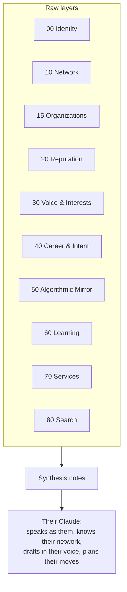

# Digital-Twin Vault — LinkedIn Export Blueprint (generic)

The structure the transform generates for **any** LinkedIn professional. Every account's export contains the same set of files, so the same mapping applies whether the user is a job seeker, salesperson, founder, freelancer, recruiter, student, or executive. The vault adapts to the person through *what's in their data*, not through configuration.

The design separates two things:

- **Raw layers** — direct imports, organized by what kind of knowledge they are.
- **Synthesis notes** — derived notes that combine layers into things no single file holds: the person's voice, their real positions, their network map, the gap between how they describe themselves and how the algorithm tags them. *This is where an archive becomes a twin.*



---

## 1. Vault structure

```
vault/
├── CLAUDE.md
│
├── 00-me/                       # IDENTITY — who the twin speaks as
│   ├── identity.md              # synthesis: the master self note
│   ├── positions/               # one note per role
│   ├── education.md
│   ├── skills.md
│   ├── certifications.md
│   └── languages.md
│
├── 10-people/                   # NETWORK — one note per person
├── 15-organizations/            # companies: employers, targets, vendors, followed
│
├── 20-reputation/               # SOCIAL PROOF
│   ├── recommendations-received.md
│   ├── recommendations-given.md
│   └── endorsements.md          # given + received, grouped by skill
│
├── 30-voice/                    # WHAT THEY PUT OUT & ENGAGE WITH
│   ├── posts/                   # shares + reposts (one note each)
│   ├── comments.md
│   ├── reactions.md             # reactions + poll votes (interest signal)
│   ├── interests.md             # followed hashtags + derived themes
│   └── saved.md                 # items they saved (curation signal)
│
├── 40-career/                   # INTENT & TRAJECTORY
│   ├── applications.md          # all job applications, consolidated
│   ├── preferences.md           # job-seeker preferences
│   ├── saved-jobs.md            # saved jobs + alerts
│   └── reusable-answers.md      # saved screening + application answers
│
├── 50-mirror/                   # HOW LINKEDIN SEES THEM
│   ├── inferences.md            # the algorithm's read of them
│   └── ad-profile.md            # ad targeting + ads clicked/engaged
│
├── 60-learning/                 # GROWTH
│   ├── coaching.md              # LinkedIn Learning coach / role-play sessions
│   └── events.md
│
├── 70-services/                 # BD / FREELANCE (Services Marketplace)
│   ├── engagements.md
│   ├── opportunities.md
│   └── providers.md
│
├── 80-search/                   # CURIOSITY LOG
│   └── search-log.md            # search queries over time
│
├── 85-places/                   # SAVED/REVIEWED LOCATIONS
│   └── <place>.md               # Google Maps saved/reviewed places, IG locations
│                                #   (via the `places` bucket / col.add_place)
├── 90-synthesis/                # THE PAYOFF (derived, not imported) — see §3
│   ├── network-map.md
│   ├── positions-i-hold.md
│   ├── target-companies.md
│   └── positioning-gaps.md
│
├── 95-goals/                    # GOAL WORKSPACES (analyze.py): fundraising / sales-bd / job-search / data-mining / personalization
├── Dashboard.md                 # tag-based Dataview tables (analyze.py)
├── _DATA_POINTS.md              # catalog: every node type + relation + field-enrichment-by-source (analyze.py)
├── _GRAPH.md                    # cross-source graph guide + color legend (analyze.py)
├── copilot-prompts/             # Obsidian-Copilot /commands incl. /mine, /for-me (analyze.py)
├── _STRUCTURE.md                # ALWAYS: the vault map — every folder/file + its role (build_vault.py)
├── _quarantine/                 # sensitive / no-value. gitignored. the agent NEVER reads
├── _SUMMARY.md                  # seed counts: notes per layer + coverage (with _COVERAGE.md, _BUILD_REPORT.md)
├── templates/
└── attachments/                 # rich media they posted
```

Folders generate **only if the source data exists** (see §5). A lurker with no posts gets no `30-voice/posts/`; someone who never used Services Marketplace gets no `70-services/`. The structure is a superset; each vault is the subset the person's data supports.

---

## 2. Full coverage table — every file has a home

Grouped by destination layer. The numeric suffix on some files (e.g. `Shares_12345678.csv`) is the account's member ID and varies per person — the parser matches on the **prefix**, not the full name.

### 00 — Identity *(present for all accounts)*
| File | Destination |
|---|---|
| `Profile.csv` | `identity.md` (core) |
| `Profile Summary.csv` | `identity.md` |
| `Positions.csv` | `00-me/positions/` — one note per role |
| `Education.csv` | `education.md` |
| `Skills.csv` | `skills.md` |
| `Certifications.csv` | `certifications.md` |
| `Languages.csv` | `languages.md` |

### 10 — Network
| File | Destination |
|---|---|
| `Connections.csv` | person notes (name, company, role, connected-date). **Emails/phones stripped at parse.** |
| `Invitations.csv` | person notes — pending/sent invites (open loops) |
| `Member_Follows_*.csv` | person notes — people followed but not connected |
| `messages.csv` | **derived signal only** → per-person count + recency → `strength` / `last_contact`. **Bodies → quarantine.** |

### 15 — Organizations
| File | Destination |
|---|---|
| `Company Follows.csv` | company notes |
| *(companies referenced in Positions, Connections, Applications)* | company notes, auto-linked to people known there |

### 20 — Reputation
| File | Destination |
|---|---|
| `Recommendations_Received.csv` | `recommendations-received.md` + linked to giver's person note |
| `Recommendations_Given.csv` | `recommendations-given.md` |
| `Endorsement_Received_Info.csv` | `endorsements.md` (by skill → strengthens `skills.md`) |
| `Endorsement_Given_Info.csv` | `endorsements.md` |

### 30 — Voice & Interests
| File | Destination |
|---|---|
| `Shares_*.csv` | `30-voice/posts/` — one note per post |
| `InstantReposts_*.csv` | `30-voice/posts/` — reposts (what they amplify) |
| `Comments_*.csv` | `comments.md` — often where the sharpest opinions live |
| `Reactions_*.csv` | `reactions.md` — interest/affinity signal |
| `Votes_*.csv` | `reactions.md` — poll votes |
| `Hashtag_Follows_*.csv` | `interests.md` |
| `Saved_Items_*.csv` | `saved.md` — what they deliberately kept |
| `Rich_Media.csv` | `attachments/`, referenced from posts |

### 40 — Career & Intent
| File | Destination |
|---|---|
| `Job Applications_1.csv … _10.csv`, `Job Applications.csv` | `applications.md` — consolidated, deduped, date-sorted |
| `Job Seeker Preferences.csv` | `preferences.md` |
| `Saved Jobs.csv`, `SavedJobAlerts.csv` | `saved-jobs.md` |
| `Online Job Postings.csv` | career context (postings viewed/posted) |
| `Job Applicant Saved Answers.csv` | `reusable-answers.md` |
| `Job Applicant Saved Screening Question Responses.csv` (+ `_1/_2/_3`) | `reusable-answers.md` — **reuse asset** for future applications |

### 50 — Algorithmic Mirror *(present for all accounts)*
| File | Destination |
|---|---|
| `Inferences_about_you.csv` | `inferences.md` |
| `Ad_Targeting.csv` | `ad-profile.md` |
| `Ads Clicked.csv` | `ad-profile.md` — clicks = revealed interest |
| `LAN Ads Engagement.csv` | `ad-profile.md` |

### 60 — Learning
| File | Destination |
|---|---|
| `learning_coach_messages.csv`, `learning_role_play_messages.csv`, `LearningCoachMessages.csv` | `coaching.md` (dedupe — these overlap across export versions) |
| `Events.csv` | `events.md` |

### 70 — Services Marketplace *(only if the feature was used)*
| File | Destination |
|---|---|
| `Engagements.csv` | `engagements.md` |
| `Opprtunities.csv` *(LinkedIn's own spelling)* | `opportunities.md` |
| `Providers.csv` | `providers.md` |

### 80 — Search
| File | Destination |
|---|---|
| `SearchQueries.csv` | `search-log.md` |

### 85 — Places
| File | Destination |
|---|---|
| Google Maps `Saved Places.json` / `Reviews.json` (GeoJSON) | `85-places/<place>.md` |
| Instagram saved/visited locations | `85-places/<place>.md` |
| Facebook `check-ins.json`, `cities_you_have_checked_into`, `places_you've_created`, `locations_of_interest`, `your_sampled_locations` | `85-places/<place>.md` |

Routed via the `places` bucket (`col.add_place`); most are driven by the declarative
JSON mappings (`engine/mappings/sources/google.json`, `instagram.json`, `facebook.json`) and
rescued by the universal harvester when no mapping claims the file.

### Facebook → layers (full coverage, `engine/mappings/sources/facebook.json`, 33 rules)
| Facebook files | Destination |
|---|---|
| `your_friends`, `people_who_followed_you`, `who_you've_followed`, sent/received/removed/rejected friend-requests | `10-people/` (role + `person/*` tags) |
| `your_posts…`, `your_contributions`, `comments`, `likes_and_reactions` | `30-voice/` (posts/comments/reactions) |
| `pages_you've_liked`, `pages_and_profiles_you_follow` | `30-voice/interests.md` |
| `ads_interests`, `ad_preferences`, advertisers, `apps_detected_*`, off-Meta activity, `age_group_prediction`, `languages_you_may_know` | **`50-mirror/`** (via the `mirror` / `ad_segment` emit) |
| `event_invitations`, `your_event_responses` | `60-learning/events.md` |
| `your_pages`, `your_groups`, `connected_apps_and_websites` | `15-organizations/` |
| `your_search_history` | `80-search/` |
| `profile_information` | `00-me/identity.md` (name + location only) |
| `ip_address_activity`, payment/cookie/password/2FA, uploaded contacts | `_quarantine/` (exact `norm_file` keys; fold into `00-me/my-*.md` in `--full`) |

### Tag taxonomy (powers the cross-source graph / Bases / Dataview)
Every entity note is tagged so the global graph colors & filters by origin and kind:
- `source/<name>` — one per contributing source (`source/linkedin`, `source/facebook`, …), added by the renderer from each note's `sources`.
- type — `person` · `company` · `place` · `post` · `mirror` · `events` · `reputation` · `synthesis`.
- semantic (declared by a mapping rule's `tags`) — `person/friend|follower|request`, `place/check-in|city|home`, `company/facebook-page|group|connected-app`, `mirror/inference|ad-segment`.

### _quarantine — sensitive or no-value (the agent never reads)
| File | Why |
|---|---|
| `Email Addresses.csv`, `PhoneNumbers.csv`, `Whatsapp Phone Numbers.csv` | the user's own sensitive contact data |
| `ImportedContacts.csv` | third-party PII, never consented |
| `Logins.csv`, `Security Challenges.csv`, `Registration.csv` | account/security metadata (keep only join-date in `identity.md`) |
| `Receipts_v2.csv` | purchase history — no knowledge value |
| `Private_identity_asset.csv` | identity-verification data — sensitive |
| `guide_messages.csv` | automated LinkedIn system messages — noise |
| raw `messages` bodies | other people's words; only derived signal is kept |

Every file in the export is a layer, a signal, or quarantined. Nothing is silently dropped.

---

## 3. The synthesis notes (where it becomes a twin)

These don't map to any single file — Claude builds them from the layers during enrichment. They're role-agnostic: the same note serves different goals depending on the person.

**`identity.md`** — the master self note. Combines Profile + Summary + Positions + Skills + top endorsements into a tight first-person brief the twin speaks from. *Layers: 00, 20.*

**`network-map.md`** — the network analyzed, not just listed: clusters by company, industry, and geography; strongest ties; and **dormant high-value connections** (warm `strength`, stale `last_contact`). One note, many uses — warm intros for a job seeker, prospects for a salesperson, investors for a founder, candidates for a recruiter, referrals for a freelancer. *Layers: 10, 15, + message signal.*

**`positions-i-hold.md`** — the person's actual public positions, mined from what they *post and comment*, not their headline. The raw material for drafting in their real voice. Usually the highest-surprise synthesis note. (Thin or skipped for low-activity accounts — that's expected.) *Layer: 30.*

**`target-companies.md`** — where they've actually been aiming, from applications + saved jobs + search queries. Often reveals drift between stated goals and real behavior. *Layers: 40, 80.*

**`positioning-gaps.md`** — the mirror comparison: how they describe themselves (00) vs how LinkedIn's models tag them (50). Gaps here explain the inbound they get. *Layers: 00, 50.*

---

## 4. Frontmatter for the generated note types

Core relationship types (`person`, `company`) plus the layer-specific types below. Note: `meeting` and `decision` notes aren't generated from an export (the data doesn't exist in it) — they're types the user adopts for ongoing notes after import.

### `person` (10-people/)
```yaml
---
type: person
title:
created:              # connection date
status: cold          # warm | cold | dormant (derived from message signal)
company: "[[ ]]"
role:
strength: 2           # 1–5 from interaction signal
last_contact:
source: connection    # connection | follow | invitation
---
```

### `company` (15-organizations/)
```yaml
---
type: company
title:
category: followed    # employer | target | vendor | followed | competitor
people: []            # contacts known there
---
```

### `post` (30-voice/posts/)
```yaml
---
type: post
title:
created:              # original post date
kind: share           # share | repost | comment
url:
themes: []            # feeds positions-i-hold.md
---
```

### `mirror` (50-mirror/)
```yaml
---
type: mirror
title:
source:               # Inferences_about_you | Ad_Targeting
inferred: []          # categories/segments LinkedIn assigned
---
```

### `career` (40-career/)
```yaml
---
type: career
title:
count:                # e.g. total applications
window:               # date range
top_roles: []
top_companies: []
---
```

---

## 5. Genericity & graceful degradation

The transform assumes the standard file set but must never assume a file is **non-empty** or **present**. Across accounts:

- **Activity varies wildly.** Heavy posters fill `30-voice/`; lurkers leave it near-empty. Synthesis notes that depend on a sparse layer are written thin or skipped, never faked.
- **Optional features.** Services Marketplace, job applications, certifications, and recommendations exist only if used. Missing file → skip the layer, no error.
- **Volume varies.** New accounts may have a handful of connections; veterans have thousands. The structure is identical; only scale differs.
- **Suffix matching.** Match files by prefix (`Shares_`, `Comments_`, `Member_Follows_`) since the member-ID suffix differs per person.
- **Export-format drift.** LinkedIn changes columns without notice. Parsers read by header name, tolerate unknown/missing columns, and version-detect where needed.

Rule: a smaller dataset yields a smaller vault, not a broken one.

---

## 6. Quarantine layer — the rule

`_quarantine/` keeps the export *complete* without letting sensitive parts pollute the brain:

1. **`CLAUDE.md` forbids reading `_quarantine/`** — it's in the ignore list and `.gitignore`.
2. **Third-party contact PII is stripped at parse time**, not just quarantined — connections' emails/phones and imported contacts never become notes. The network keeps *structure*, not other people's details.
3. **Message bodies stay quarantined; only derived signal** (count, recency per person) crosses into the brain.

---

## 7. CLAUDE.md additions — how the twin uses each layer

```markdown
## Layer usage
- Speak as the user from 90-synthesis/identity.md. That note is the voice of record.
- For network questions (intros, prospects, candidates, referrals — whatever the
  user is working toward), use 90-synthesis/network-map.md, then drill into
  10-people/ and 15-organizations/.
- When drafting posts, comments, or messages in the user's voice, ground tone and
  stance in 30-voice/ and 90-synthesis/positions-i-hold.md — never invent opinions
  they haven't expressed. If the voice layer is sparse, say so rather than guessing.
- For job-search or BD work, use 40-career/ and 90-synthesis/target-companies.md;
  pull ready text from 40-career/reusable-answers.md instead of writing fresh.
- When asked about perception, contrast 00-me/ against 50-mirror/ via
  90-synthesis/positioning-gaps.md.
- NEVER read _quarantine/. Never surface anyone's email, phone, or private
  message body — that data isn't in the brain by design.
```

---

## 8. Build order

1. Scaffold folders + `CLAUDE.md` + templates.
2. Run the deterministic transform (raw layers 00–80), skipping absent files.
3. Strip/quarantine sensitive files per §6.
4. Run the Claude enrichment pass to build `90-synthesis/` and tight cross-links.
5. Query. A first query that exercises several layers at once, adaptable to any goal:
   *"Using my network map, find the strongest connections relevant to what I'm
   currently working toward, and draft an outreach message to each in my voice."*
```
